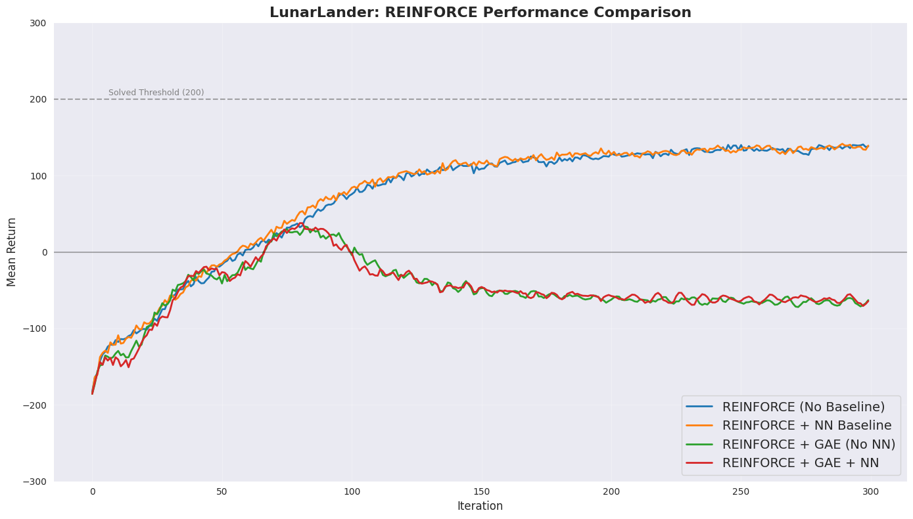
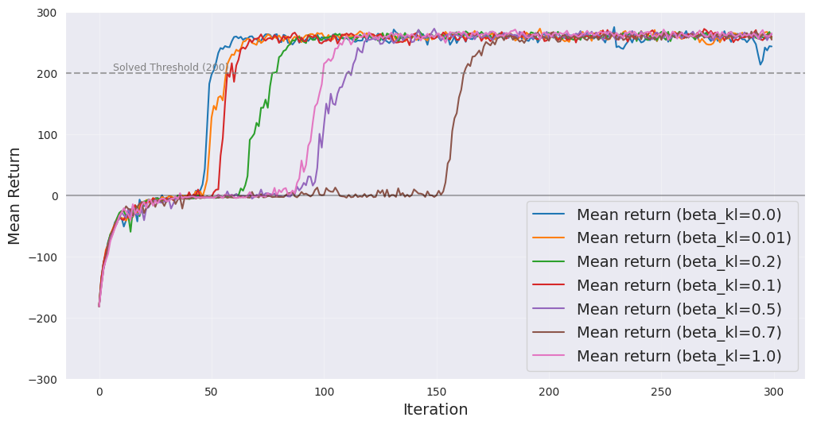
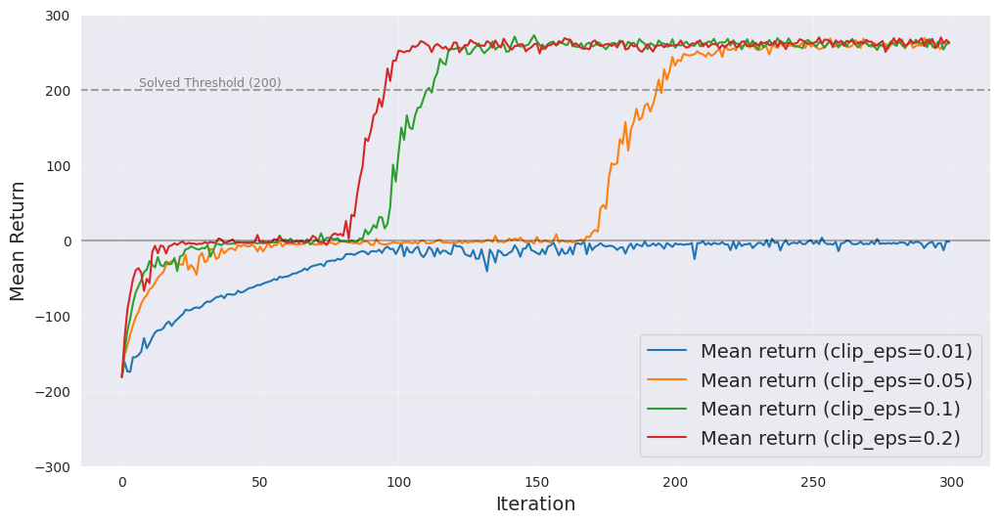
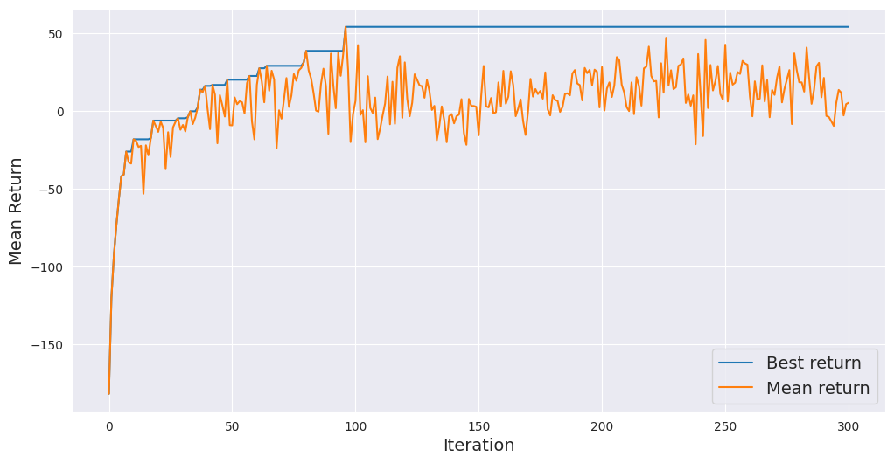
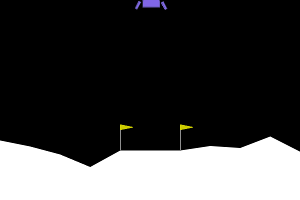
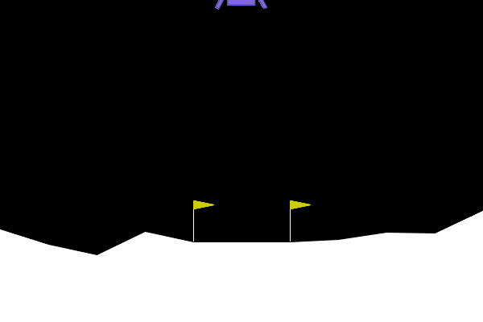
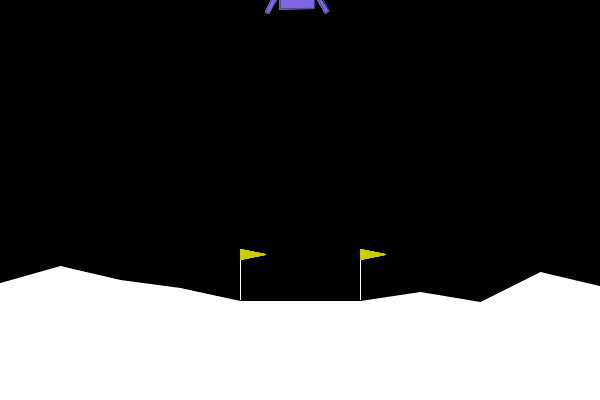

# 👾 Lunar Lander RL Project

This project implements and compares three policy-gradient algorithms — **REINFORCE**, **PPO**, and **GRPO** — on the discrete Lunar Lander environment from Gymnasium. We evaluate all methods on **mean return** and **success rate** (return ≥ 200) and provide training curves, hyperparameter sweeps, and animated demos of the trained agents.

---

## Environment Description

**Reference:** [Lunar Lander – Gymnasium](https://gymnasium.farama.org/environments/box2d/lunar_lander/#arguments)

### Problem description

**Goal:** Land the lunar lander safely on the landing pad at coordinates **(0, 0)**. The agent must choose thrust (main engine and left/right orientation engines) so that the lander touches the ground at low speed, roughly upright, with both legs in contact, and without crashing. Fuel is unlimited.

### Environment dynamics

#### State space (observation)

8-dimensional vector: 6 continuous, 2 boolean components

| Index | Meaning            | Min    | Max     |
|-------|--------------------|--------|---------|
| 0     | x position         | -2.5   | 2.5     |
| 1     | y position         | -2.5   | 2.5     |
| 2     | x velocity         | -10    | 10      |
| 3     | y velocity         | -10    | 10      |
| 4     | angle (rad)        | -2π    | 2π      |
| 5     | angular velocity   | -10    | 10      |
| 6     | left leg contact   | 0 or 1 |         |
| 7     | right leg contact  | 0 or 1 |         |

- **Initial state:** The lander starts at the top center of the viewport with a random initial force applied to its center of mass.

#### Action space

`Discrete(4)`:
- 0: do nothing
- 1: left engine
- 2: main engine
- 3: right engine

#### Transition logic

- **Gravity:** Constant vertical acceleration (default `gravity = -10`, bounded in [0, -12]).
- **Engines:** Main engine: vertical thrust; side engines: thrust + torque (orientation-dependent per implementation). Discrete: on/off.
- **Wind (optional):** If `enable_wind=True`, wind uses  
  `tanh(sin(2k(t+C)) + sin(πk(t+C)))` with `k=0.01`, `C` random in [-9999, 9999] at reset; `wind_power` and `turbulence_power` scale linear and rotational wind.
  - Remark: We did not use wind in our Project

So: **next state = physics(state, action, gravity, wind)** (Box2D step).

#### Deterministic vs stochastic transitions

- **Stochastic:**   
  - If `enable_wind=True`: wind (and thus transitions) depend on random `C` and time.  
- **Deterministic:** With `enable_wind=False`, given the same initial state and action sequence, transitions are deterministic.

### Episode termination

An episode ends when any of the following happens:

| Condition | Meaning |
|-----------|---------|
| **Crash** | Lander body contacts the moon surface (unsafe landing or collision). |
| **Out of viewport** | `x` > 1 (lander leaves the visible area). |
| **Not awake** | Box2D marks the body as sleeping (at rest, no collisions). |

Termination is detected at the *start* of the step after the event (e.g. crash reward is given when stepping into the terminal state).

### Reward function

Per-step and terminal rewards (episode return = sum of step rewards + terminal reward):

| Event | Reward |
|-------|--------|
| Closer to landing pad (0,0) | Positive (scaled by distance) |
| Farther from landing pad | Negative (scaled by distance) |
| Slower horizontal/vertical speed | Positive |
| Faster horizontal/vertical speed | Negative |
| More tilted (angle away from horizontal) | Negative |
| Each leg in contact with ground | **+10** per leg per step |
| Side engine firing (per frame) | **-0.03** |
| Main engine firing (per frame) | **-0.3** |
| **Landing safely** (episode end) | **+100** |
| **Crashing** (episode end) | **-100** |

"Solved" episode: Total Return $\ge$ 200

---

## Algorithms

All algorithms use a shared neural network architecture (`NeuralPolicy`): a 3-layer MLP with ReLU activations producing action logits, and optionally a separate `ValueNetwork` of the same shape outputting a scalar state value.

### REINFORCE

Implemented in `src/reinforce.py`. A single `train_reinforce()` function supports **four baseline variants** controlled by the `--baseline` flag:

| Variant | `--baseline` flag | Description |
|---------|-------------------|-------------|
| **Vanilla REINFORCE** | `none` | No baseline; raw Monte-Carlo returns $G_T$ used as advantage. |
| **NN Value baseline** | `nn` | Learned `ValueNetwork` $V_\phi(S)$ as baseline; advantage $\mathcal{A}_T = G_T - V_\phi(S_T)$, no GAE. |
| **GAE without NN** | `gae_no_nn` | GAE with per-timestep batch-averaged returns as value estimate (no learned network). |
| **GAE + NN** | `gae_nn` | Full GAE ($\lambda = 0.95$) with a learned `ValueNetwork`. |

All variants support entropy regularization (`--entropy-coef`) and advantage normalization (on by default).

### PPO (Proximal Policy Optimization)

Implemented in `src/ppo.py`.


$$
\hat{L}_{\text{PPO-CLIP}} := \mathbb{E}_{T \sim \text{Unif}[0, \tau_b-1]}\left[\min\left(\frac{\pi^{\text{new}}(A_T \mid S_T)}{\pi^{\text{old}}(A_T \mid S_T)} \mathcal{A}^{\pi_{old}}(S_T, A_T),\ \text{clip}_{1-\epsilon}^{1+\epsilon}\left(\frac{\pi^{\text{new}}(A_T \mid S_T)}{\pi^{\text{old}}(A_T \mid S_T)}\right) \mathcal{A}^{\pi_{old}}(S_T, A_T)\right)\right]
$$

Supports an optional KL-divergence penalty (`--beta-kl`) for additional policy regularization:

$$\hat{L}_{\text{PPO}} = \hat{L}_{\text{PPO-CLIP}} + c_v L^{\text{value}} - c_e H[\pi^{\text{new}}] + \beta_{\text{KL}} D_{\text{KL}}(\pi^{\text{old}} \| \pi^{\text{new}})$$

### GRPO (Group Relative Policy Optimization)

Implemented in `src/grpo.py`. Like PPO but **without a value network**. At each iteration, `n_groups` groups of `group_size` complete episodes are collected in parallel via a single vectorized environment of size `n_groups × group_size`. All episodes within a group share the same initial state $S_0$ (same seed), making their returns directly comparable.

**Group-relative advantage.** For group $g$, let $R^{(g,i)} = \sum_t R_t^{(g,i)}$ be the undiscounted return of episode $i \in \{1,\ldots,G\}$. The group-relative advantage is:

$$\mathcal{A}^{(g,i)} = \frac{R^{(g,i)} - \text{mean}\left(R^{(g,1)}, \ldots, R^{(g,G)}\right) }{\text{std}\left(R^{(g,1)}, \ldots, R^{(g,G)}\right) + \varepsilon}$$

This is **constant for every timestep** within episode $(g,i)$: $\mathcal{A}_T^{(g,i)} = \mathcal{A}^{(g,i)}$.

**Clipped surrogate.** The advantage $\mathcal{A}^{(g,i)}$ is constant within the episode, so the expectation is over groups, episodes, and timesteps jointly:

$$\hat{L}_{\text{GRPO-CLIP}} := \mathbb{E}_{\substack{g \sim [N_g],\; i \sim [G] \\ T \sim \tau^{(g,i)}}}\!\left[\min\!\left(\frac{\pi^{\text{new}}(A_T^{(g,i)} \mid S_T^{(g,i)})}{\pi^{\text{old}}(A_T^{(g,i)} \mid S_T^{(g,i)})}\,\mathcal{A}^{(g,i)},\ \text{clip}_{1-\epsilon}^{1+\epsilon}\!\left(\frac{\pi^{\text{new}}(A_T^{(g,i)} \mid S_T^{(g,i)})}{\pi^{\text{old}}(A_T^{(g,i)} \mid S_T^{(g,i)})}\right)\mathcal{A}^{(g,i)}\right)\right]$$

where $g \sim [N_g]$ denotes a group index sampled uniformly from the $N_g$ groups (`n_groups`), each seeded with a distinct initial state $S_0^{(g)}$; $i \sim [G]$ denotes an episode index sampled uniformly from the $G$ episodes within that group (`group_size`), all starting from $S_0^{(g)}$; and $T \sim \tau^{(g,i)}$ denotes a timestep sampled uniformly from the valid timesteps of episode $(g, i)$. In practice all valid $(g, i, T)$ triples are flattened into a buffer and mini-batched uniformly.

**Total objective** (no value network, no KL penalty):

$$\hat{L}_{\text{GRPO}} = \hat{L}_{\text{GRPO-CLIP}} + c_e\,H[\pi^{\text{new}}]$$

The policy is updated for `n_epochs` passes over the collected data with mini-batches of size `batch_size`.

---

## Project Structure

```
lunarlander-rl/
├── README.md
├── requirements.txt
├── scripts/
│   ├── train_reinforce.sh
│   ├── train_ppo.sh
│   ├── train_grpo.sh
│   └── eval.sh
├── src/
│   ├── reinforce.py
│   ├── ppo.py
│   ├── grpo.py
│   └── eval.py
├── images/                 # Training curves
├── results/                # Evaluation outputs (JSON, GIFs)
└── visualize.ipynb         # Visualization notebook
```

### Source files and classes

| File | Classes / Functions | Purpose |
|------|-------------------|---------|
| `src/reinforce.py` | `NeuralPolicy`, `ValueNetwork`, `compute_returns`, `compute_gae`, `train_reinforce` | Policy and value network definitions (shared by all algorithms), REINFORCE training with 4 baseline modes |
| `src/ppo.py` | `compute_gae_buffer`, `train_ppo` | PPO training with clipped surrogate, GAE, optional KL penalty |
| `src/grpo.py` | `train_grpo` | GRPO training — value-free PPO-style with per-group normalized episode returns |
| `src/eval.py` | `evaluate_policy`, `_load_policy` | Load a saved checkpoint, run evaluation episodes, compute metrics, save GIF |

---

## Installation

```bash
uv venv
source .venv/bin/activate
uv pip install -r requirements.txt
```

**Dependencies:** `gymnasium`, `torch`, `numpy`, `imageio`, `box2d`, `pygame`, `matplotlib`, `tqdm`, `pandas`.

---

## Usage

### Training

All training scripts are in `./scripts/`. Each script trains from scratch, saves periodic checkpoints and `best_policy.pt`, and logs per-iteration metrics to a CSV file.

**REINFORCE:**

```bash
CUDA_VISIBLE_DEVICES=0 python src/reinforce.py \
  --n-iter            300       \
  --n-episodes        512       \
  --num-envs          64        \
  --alpha             1e-3      \
  --gamma             0.99      \
  --entropy-coef      0.01      \
  --baseline          nn        \
  --baseline-lr       1e-4      \
  --hidden-size       512       \
  --seed              42        \
  --exp-dir           runs/reinforce_nn \
  --save-every-n      50
```

**PPO:**

```bash
CUDA_VISIBLE_DEVICES=0 python src/ppo.py \
  --n-iter            300       \
  --num-envs          64        \
  --alpha             3e-4      \
  --gamma             0.99      \
  --entropy-coef      0.01      \
  --hidden-size       1024      \
  --seed              42        \
  --save-every-n      10        \
  --exp-dir           runs/ppo_exp \
  --batch-size        512       \
  --clip-eps          0.1       \
  --max-grad-norm     1.0       \
  --beta-kl           0.5
```

**GRPO:**

```bash
CUDA_VISIBLE_DEVICES=0 python src/grpo.py \
  --n-iter            500       \
  --n-groups          32        \
  --group-size        16        \
  --alpha             3e-4      \
  --entropy-coef      0.01      \
  --hidden-size       1024      \
  --seed              42        \
  --save-every-n      10        \
  --exp-dir           runs/grpo_exp \
  --batch-size        512       \
  --clip-eps          0.1       \
  --max-grad-norm     1.0
```

Or simply run via the provided shell scripts:

```bash
bash scripts/train_reinforce.sh
bash scripts/train_ppo.sh
bash scripts/train_grpo.sh
```

#### Training output

Each training run creates an experiment directory (`--exp-dir`) containing:
- `metrics.csv` — per-iteration logs: mean/best/min/max return, policy loss, value loss, entropy, KL divergence (PPO)
- `checkpoints/` — periodic model checkpoints (`.pt` files)
- `best_policy.pt` — state dict of the policy with the highest mean return during training

### Evaluation

Use `src/eval.py` to load a trained checkpoint, run evaluation episodes, and save results:

```bash
python src/eval.py \
  --checkpoint  runs/ppo_exp/best_policy.pt \
  --results-dir results/ppo \
  --n-episodes  100
```

The evaluation script:
1. Loads the policy network from the checkpoint
2. Runs `--n-episodes` episodes (stochastic by default, `--deterministic` for greedy)
3. Saves a **JSON** file with mean return, std, min, max, and success rate
4. Saves a **GIF** of a successful landing (or the last episode if none succeed)

Batch evaluation examples are provided in `scripts/eval.sh`.

---

## Results

### Quantitative comparison

- Evaluation performed over 100 sampled trajectories:

| Algorithm | Mean Return | Success Rate |
|-----------|------------|--------------|
| REINFORCE (NN Value baseline) | 137.1 | 0.01 |
| PPO ($\beta_{\text{KL}}$ = 0.5) | **288.97** | **0.99** |
| GRPO ($\beta_{\text{KL}}$ = 0) | 97.6 | 0.09 |

PPO with a moderate KL penalty achieves near-perfect success rate and well above the 200-point "solved" threshold. REINFORCE with NN baseline learns a reasonable policy but fails to consistently solve the task. GRPO without KL regularization underperforms both, suggesting that a learned value baseline is critical for stable learning in this environment.

### Training curves

**REINFORCE** (all baseline variants):



**PPO** — effect of KL penalty coefficient:



**PPO** — effect of clipping epsilon:



**GRPO:**



### Trained agent demos

**Best REINFORCE agent** (NN Value baseline):



**Best PPO agent** ($\beta_{\text{KL}}$ = 0.5):



**Best GRPO agent:**



---

## Reproducibility

- All experiments use `--seed 42` for reproducible results
- Full hyperparameter configurations are documented in the training scripts (`scripts/`)
- Evaluation results (JSON) and checkpoints are saved in `results/` and `runs/`
